# 像SPARK，FINK一样的使用Jet

## JET介绍
Jet 是一款纯使用Java语言编写的流计算框架，支持时间窗口，会话窗口的等常用流计算功能，并且无需其他第三方中间件，直接使用springboot启动就能使用，易于部署，适合轻量级需求

## 项目介绍
本项目顾名思义，就是希望可以想Spark,Flink那样提交计算任务，并且对计算任务进行一定的管理，本次仅提供对计算的任务的上传，重启，取消，挂起，唤醒的功能。
本项目使用的是Jet-4.1的版本，基于Jet-4.1版本，对Jet的源码做了一些修改，你可以去这里获取我修改后的Jet-4.1版本Jar包，替换掉仓库中原本的jar包即可。

### Jet-4.1 Jar包地址
链接: https://pan.baidu.com/s/1v1yPsKIoSUB-i-3p5S6-Hw 提取码: c09m

解压后覆盖掉仓库原有的包即可

## 赞助与联系
如果你想使用他，或者你有什么想法，欢迎找我讨论，当然如果你觉得好用话，也请赞助一下(๑•́ ₃•๑)呢

微信联系方式


微信收款码


Line联系方式


支付宝收款码


## 启动项目
本项目使用Springboot构建的后端，vue构建的前端，使用时需要将两个服务都起来，另外该项目在window下运行可能，存在问题，建议使用linux/unix来运行这个项目
```
1. 启动后端
cd ~/jet/jetPro
mvn clean package
cd target
java -jar jet-pro-0.0.1-SNAPSHOT.jar

2. 启动前端
cd ~/jet/jet-client
npm run dev
```
此时用浏览器访问：http://localhost:8080，进入任务管理界面，此时就可以开始任务上传了
示例程序用到的计算任务Jar包，下载地址如下
链接: https://pan.baidu.com/s/1eEfi74v8jLUeUoS-4O3gAA 提取码: d4cw

### 1.上传任务
鼠标放到设置这里，点击上传，就可以上传流计算的任务了，如下图
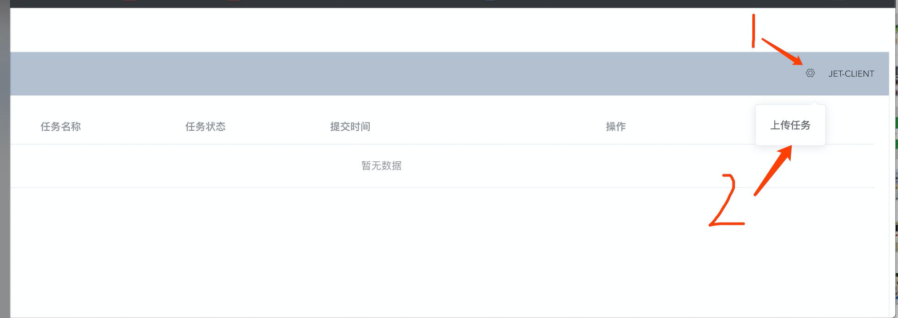
这里我们使用一个WordCount的程序来演示这个任务上传功能，首先你需要编写你的流计算任务，这个流计算任务使用Java需要编写，写好后达成java的jar包即可，如下图所示
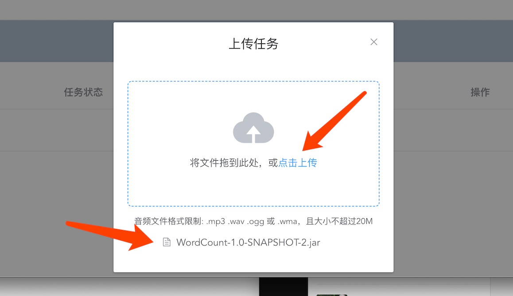
上传完成后，我们会发现任务被提交到Jet上开始运行，并且在界面上可以看到此时正在运行的任务，如下图
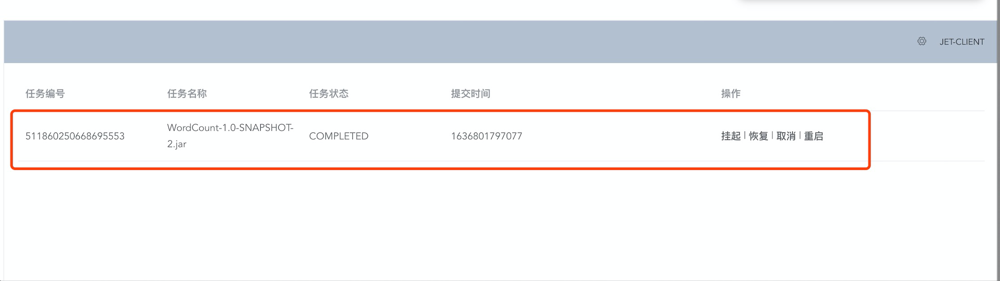
这个任务的状态是COMPLED，说明这个任务已经执行完毕了。此时再对这个任务进行重启，取消，挂起，恢复的操作将无法生效，只能对正在运行中的任务进行上述的操作，下面来演示下
这些功能。

### 2.挂起任务
首先我们提交一个会长时间运行的任务，我们使用官方的一个example来演示，我们一样去提交这个任务，如下图
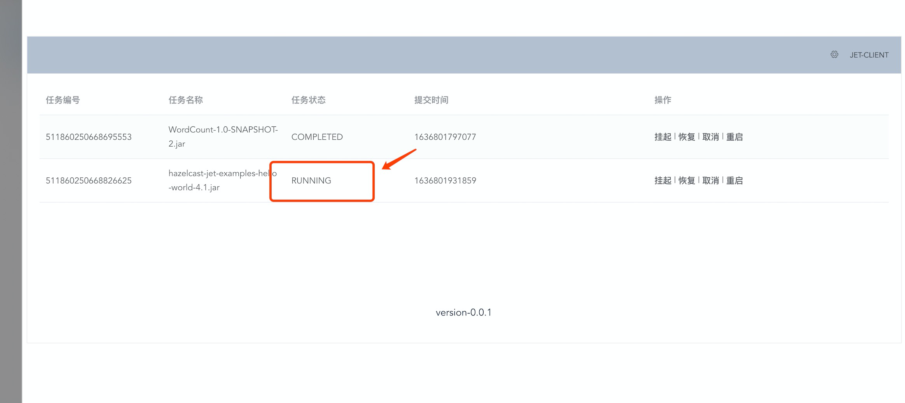
并且我们发现这个任务一直在输出计算结果
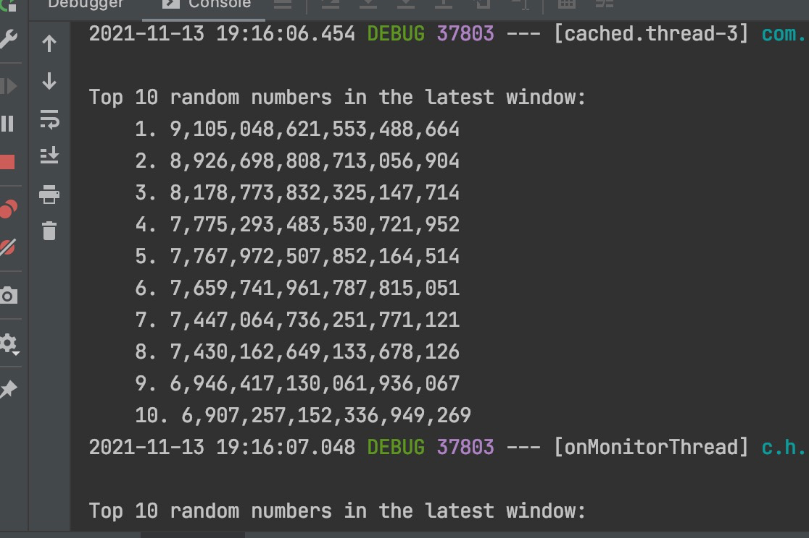
现在我们开始执行挂起操作，如图
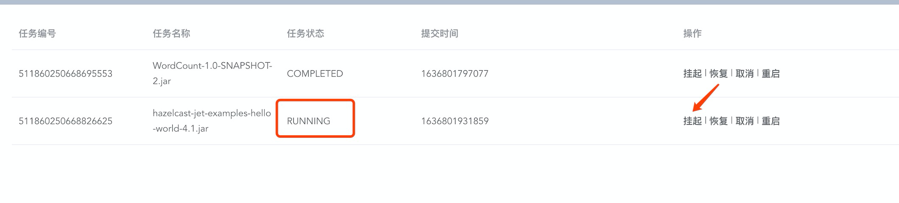
此时我们发现任务状态变成了suspended,并且计算结果不在输出，任务被挂起

### 3.恢复任务
此时我们将刚刚挂起的任务给恢复运行，点击恢复，如下图
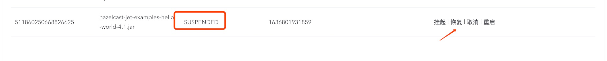
我们发现任务的状态恢复到了running的状态，并且计算结果又开始输出了


### 4.重启任务
任务在运行的状态下时，我们可以对任务进行重启的操作，任务会重新提交一次，如下图
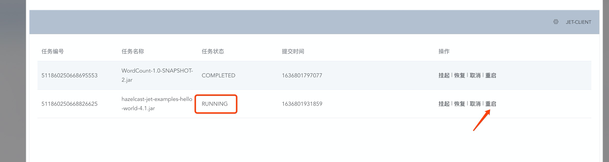
才是发现任务被重新提交了
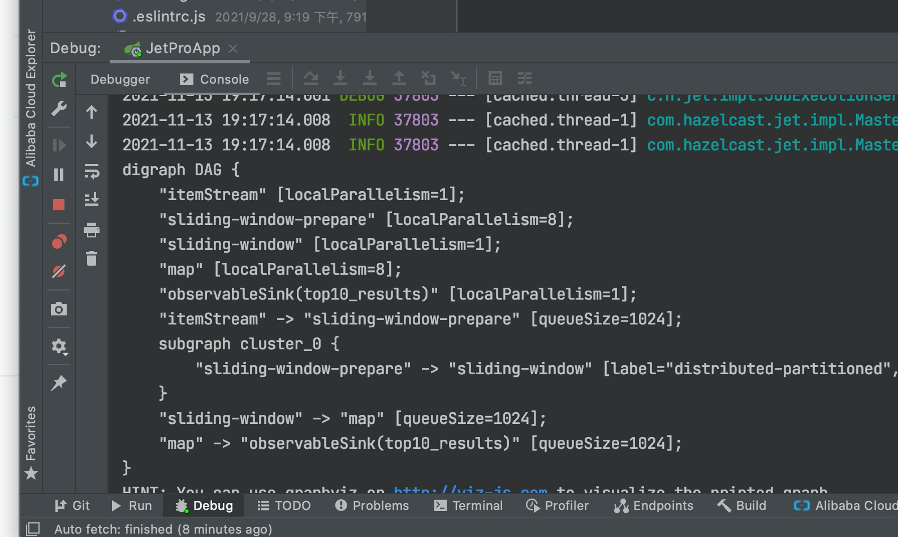

### 5.取消任务
注意这个操作是不可逆的，点击取消的按钮，意味着强行中止当前正在运行的任务，任务的状态会变成failed,并且无法对该任务进行重启，挂起等操作,如下图所示
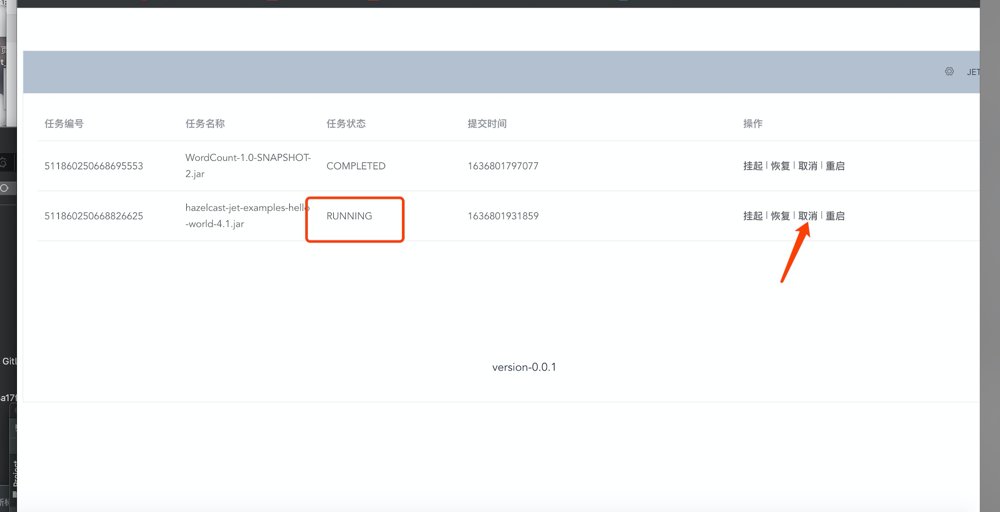
取消后任务，状态变成failed，如下图
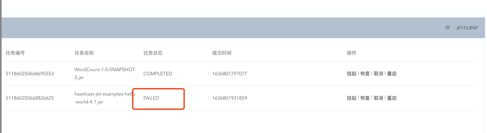
并且任务计算的结果也不在输出
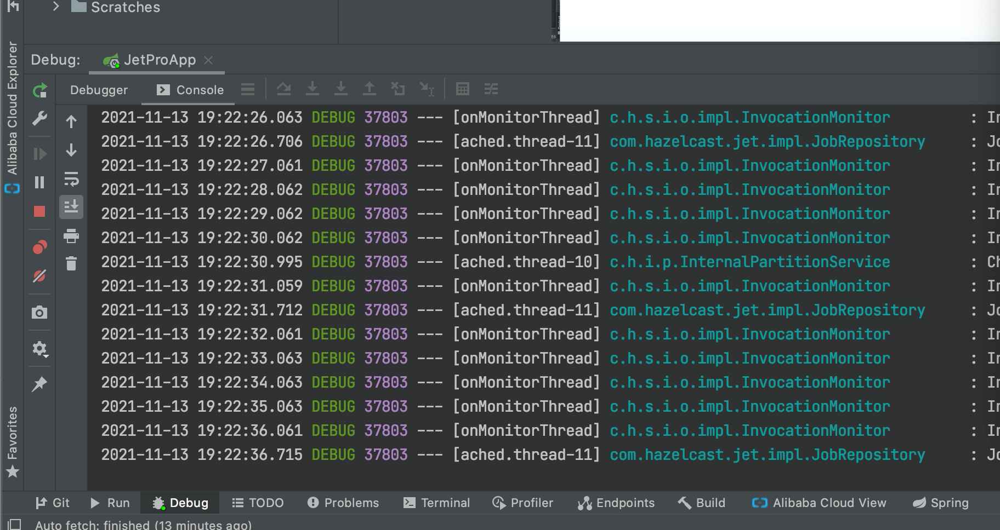


